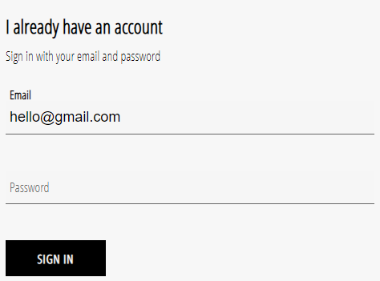

## Styled Form Components

- [Form Input](./FormInput)
- [Button](./Button)
- [Sign In Form](./SignInForm)

### 1.Input Component

A custom styled form input component (types: text, email, password). By default takes up 100% width of the form (Can be changed in the [FormInput.scss](./FormInput/FormInput.scss) file). Accepts props:

- type
- name
- value
- label
- id
- required

Passing a handleChange function is also necessary

### 2.button

A styled button to go with the input fields. Visual feedback on user interaction. Accepts a type of submit.

### 3.Sign In Form

Both components are put together in a Sign In form component as well.

Font used here is Open Sans Condensed from Google Fonts.
